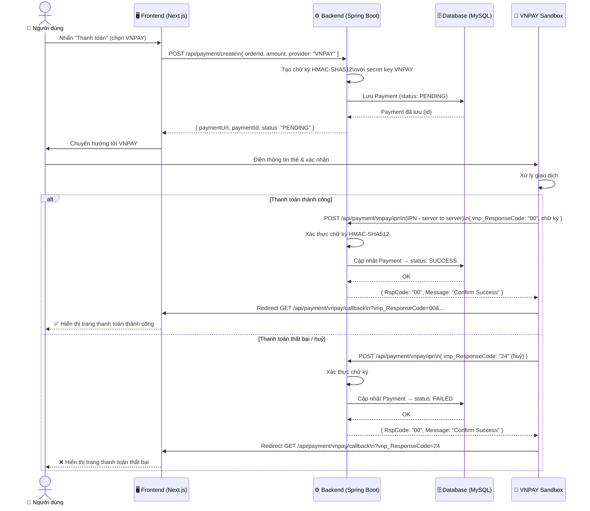
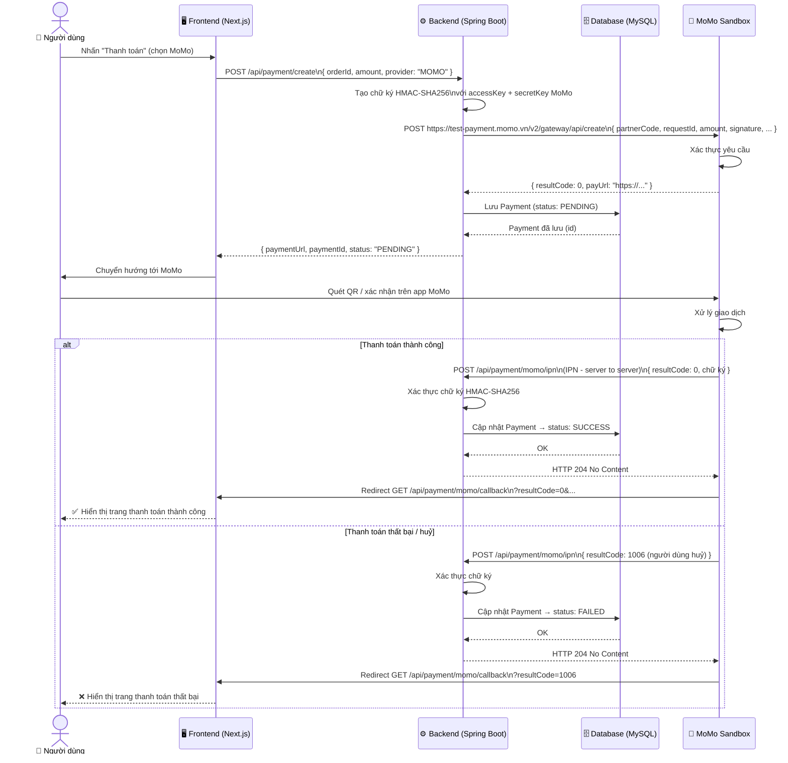

# 💳 UML Sequence Diagram — Luồng Thanh Toán Online

Tài liệu này mô tả luồng xử lý thanh toán qua **VNPAY** và **MoMo Sandbox** theo chuẩn UML Sequence Diagram.

---

## 1. Luồng Thanh Toán VNPAY



### Giải thích các bước VNPAY

| Bước | Diễn giải |
|------|-----------|
| **1. Tạo link** | Backend tạo URL thanh toán với tham số được ký bằng HMAC-SHA512, lưu Payment vào DB với trạng thái `PENDING` |
| **2. Redirect** | Frontend chuyển hướng người dùng sang trang thanh toán VNPAY Sandbox |
| **3. IPN (server-to-server)** | VNPAY gọi thẳng vào backend để xác nhận kết quả — **đây là kênh đáng tin cậy nhất** |
| **4. Verify chữ ký** | Backend xác thực chữ ký để đảm bảo dữ liệu không bị giả mạo |
| **5. Cập nhật DB** | Backend cập nhật trạng thái Payment trong database |
| **6. Callback** | VNPAY redirect trình duyệt về frontend để hiển thị kết quả cho người dùng |

> ⚠️ **Quan trọng:** Chỉ cập nhật trạng thái đơn hàng sau khi xác thực IPN thành công, **không** dựa vào callback URL (vì người dùng có thể tắt trình duyệt trước khi callback).

---

## 2. Luồng Thanh Toán MoMo



### Giải thích các bước MoMo

| Bước | Diễn giải |
|------|-----------|
| **1. Tạo yêu cầu** | Backend gọi API MoMo để tạo giao dịch, nhận về `payUrl` |
| **2. Ký HMAC-SHA256** | Tất cả tham số được ký bằng `secretKey` trước khi gửi cho MoMo |
| **3. Lưu PENDING** | Backend lưu Payment vào DB với trạng thái `PENDING` |
| **4. Redirect** | Frontend chuyển hướng người dùng sang trang thanh toán MoMo |
| **5. IPN (notify_url)** | MoMo gọi `notify_url` để thông báo kết quả — kênh đáng tin cậy |
| **6. Verify + Update** | Backend xác thực chữ ký và cập nhật trạng thái trong DB |
| **7. Callback** | MoMo redirect trình duyệt về `return_url` trên frontend |

### MoMo Result Codes thường gặp

| Code | Ý nghĩa |
|------|---------|
| `0` | Thành công |
| `1006` | Người dùng huỷ giao dịch |
| `1005` | Hết hạn giao dịch |
| `11` | Truy cập bị từ chối (sai chữ ký) |
| `99` | Lỗi không xác định |

---

## 3. So sánh VNPAY vs MoMo

| Tiêu chí | VNPAY | MoMo |
|----------|-------|------|
| **Phương thức ký** | HMAC-SHA512 | HMAC-SHA256 |
| **Tạo link** | Backend tự build URL với query params | Backend gọi API MoMo → nhận `payUrl` |
| **IPN endpoint** | `/api/payment/vnpay/ipn` (GET hoặc POST) | `/api/payment/momo/ipn` (POST) |
| **Success code** | `vnp_ResponseCode = "00"` | `resultCode = 0` |
| **Phương thức thanh toán** | ATM, thẻ quốc tế, QR | Ví MoMo, QR |
| **Sandbox** | Có (thẻ test cố định) | Có (tài khoản test) |

---

## 4. Bảng thanh toán trong DB (`payments`)

```
payments
├── id              BIGINT PK AUTO_INCREMENT
├── order_id        VARCHAR(100)     -- mã đơn hàng
├── amount          BIGINT           -- số tiền VND
├── provider        ENUM('VNPAY','MOMO')
├── status          ENUM('PENDING','SUCCESS','FAILED','REFUNDED')
├── transaction_id  VARCHAR(100)     -- mã GD từ cổng thanh toán
├── payment_url     TEXT             -- URL thanh toán
├── created_at      DATETIME
└── updated_at      DATETIME
```
